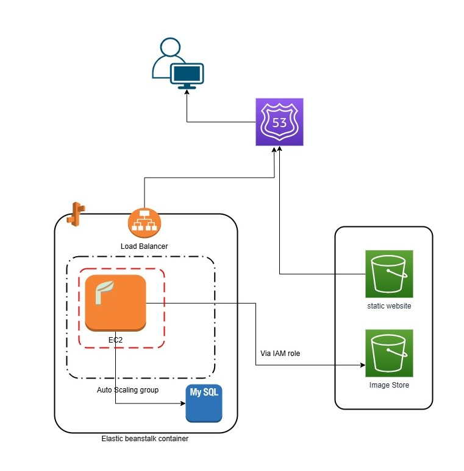

## Hi there 👋

**avinashry/avinashry** is a ✨ _special_ ✨ place to know me as  professional 

**Introduction**

I am a results-oriented Senior Full Stack Developer and Technical Lead with 15+ years of professional experience in the IT sector, specializing in Java/J2EE and modern UI technologies like Angular. 
Based in the Utrecht area, my career has been deeply involved with the financial sector, where I have spent significant time driving critical projects for Banking sector.

My journey start in early 200*, leading to a critical onsite role in the Netherlands starting around 20**. In this capacity, I served as a Lead Developer and Onsite Coordinator, responsible not only for hands-on development 
but also for managing and mentoring offshore teams, defining high-level designs, and ensuring overall team delivery.

I excel at bridging the gap between technical execution and architectural vision. I have a broad technical toolkit including Spring Boot, Microservices, OpenAPI, AWS, CMS (XperienCentral), and JVM Performance Engineering. 
My core strength is my ability to act as both a strategic individual contributor and a technical leader, allowing me to fully understand how complex systems interact and deliver solutions that are not just best in theory, 
but suitable and effective within the given business and architectural environment.

**Challenging Assignment – Hobby Project**

While the following points cover the scope of my work, the descriptions are kept at a high level to avoid disclosing any specific client or project details.

**Clean Up Drive**

This is a brief initiative designed to encourage employee participation in local cleanup efforts. Employees are invited to collect trash in their area, submit a photo of their filled trash bag, 
and the employee who collects the most will win a prize. 
I got chance to work (volunteer) one of our initiative, called “Young **** Clean up”. For this project, 
I have built complete backend API using AWS cloud infrastructure. This was not a complex project, but I got a chance to hands-on AWS system design and time was crucial. 

Project high level Overview

 

